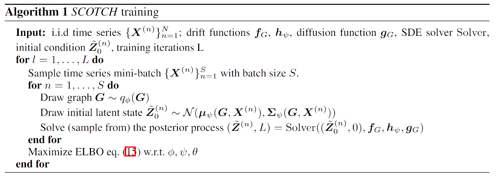

# Neural Structure Learning with Stochastic Differential Equations

这篇论文介绍了一种名为SCOTCH（Structure learning with COntinuousTime stoCHastic models）的新型结构学习方法，它结合了随机微分方程（SDE）和变分推断，用于从时间序列数据中推断变量间可能的结构。

## 绪论

### 问题引入及分析

时间序列数据在现实世界中无处不在，通常由在不同时间间隔记录的一系列数据点组成。理解与时间过程相关的变量之间的底层结构对于许多现实世界的应用至关重要。

现有离散时间结构学习的不足之处:

- 当真正的底层过程连续，可能推断出不正确的因果关系
- 难以处理不规则的采样间隔

本文引入了一种新的连续框架，采用随机微分方程（SDEs）学习时间序列中的因果结构。

### 文章贡献

- 与之前使用常微分方程的方法相比，该模型能够从🚩多模态和🚩非高斯分布的时序数据中准确地学习潜在的因果关系。
- 证明了当SDEs直接用于观测过程的建模时，所得到的SDEs在全局Lipschitz和对角线噪声假设下在结构上是🚩可识别的。
- 对合成和真实世界的数据集进行了🚩广泛的实验，表明SCOTCH可以改进现有的结构学习方法，包括当数据不规则抽样时。

## 预备知识

### 贝叶斯结构学习

目的：从数据中推断表示变量之间的有向关系图（因果图）。

给定时间序列数据 $\{\boldsymbol X_{t_i}\}_{i=1}^{I}$ ，包含 $I$ 个结点。假设有 $N$ 个独立同分布的数据，给定图 $\boldsymbol G\in\{0,1\}^{D\times D}$，定义图与数据的联合分布：$p(\boldsymbol{G},\boldsymbol{X}^{(1)},\cdots,\boldsymbol{X}^{(N)})=p(\boldsymbol{G})\prod_{n=1}^{N}p(\boldsymbol{X}^{(n)}|\boldsymbol{G})$ 

其中 $p(\boldsymbol{G})$ 是图的先验分布，$p(\boldsymbol{X}^{(n)}|\boldsymbol{G})$ 是似然项。

目的是学习后验分布 $p(\boldsymbol G|\boldsymbol X^{(1)},\cdots, \boldsymbol X^{(N)})$ ：
$$
p(\boldsymbol G|\boldsymbol X^{(1)},\cdots, \boldsymbol X^{(N)})=\dfrac{p(\boldsymbol{G},\boldsymbol{X}^{(1)},\cdots,\boldsymbol{X}^{(N)})}{p(\boldsymbol{X}^{(1)},\cdots,\boldsymbol{X}^{(N)})}=\dfrac{p(\boldsymbol{G})\prod_{n=1}^{N}p(\boldsymbol{X}^{(n)}|\boldsymbol{G})}{\sum_{\boldsymbol{G}} p(\boldsymbol{G})\prod_{n=1}^{N}p(\boldsymbol{X}^{(n)}|\boldsymbol{G})}\tag{1}
$$
但是由于图 $\boldsymbol{G}$ 所在的空间维度很高，因此需要使用变分推断与采样来学习后验分布 $p(\boldsymbol G|\boldsymbol X^{(1)},\cdots, \boldsymbol X^{(N)})$ 。

### 结构方程模型 (SEM)

给定时间序列数据 $\{\boldsymbol X^{(n)}\}_{n=1}^{N}$ 和图 $\boldsymbol G\in\{0,1\}^{D\times D}$ ，可以使用 SEM描述变量间的结构关系：
$$
\boldsymbol X_{t,d}=f_{t,d}(Pa_{\boldsymbol{G}}^d(<t),\epsilon_{t,d})\tag{2}
$$
$Pa_{\boldsymbol{G}}^d(<t)$ 表示父节点在之前时刻的数据， $\epsilon_{t,d}$ 表示相互独立的噪声。

该模型需要离散的时间步长，这些时间步长通常被假定为遵循规则的采样间隔。现有模型大多遵循此框架。

### 伊藤扩散过程 (Ito diffusion)

假设 $\boldsymbol X_t$ 是非时变 (time-homogenous) 的伊藤过程，则
$$
d\boldsymbol X_t=f(\boldsymbol X_t)dt+g(\boldsymbol X_t)d\boldsymbol W_t\tag{3}
$$
其中 $f:\mathbb{R}^D\to\mathbb{R}^D,g:\mathbb{R}^D\to\mathbb{R}^{D\times D}$ 分别是非时变的漂移项和扩散项。$\boldsymbol W_t$ 是测度 $P$ 下的布朗运动。

若全局Lipschitz条件满足，则 (3) 式有唯一强解 ([2] Thm 5.2.1)：
$$
\boldsymbol X_t=\lim_{n\to\infty}\boldsymbol Y_t^{(n+1)}=\lim_{n\to\infty}\left(\boldsymbol X_0+\int_0^tf(\boldsymbol Y_s^{(n)})ds+\int_0^tg(\boldsymbol Y_s^{(n)})dB_s\right)
$$
其中 $\boldsymbol Y_{t}^{(0)}=\boldsymbol X_{0}$，$\boldsymbol Y_{t}^{(k)}=\boldsymbol Y_{t}^{(k)}(\omega)$ 

但是对于大多数伊藤扩散过程，比如拥有非线性漂移和扩散函数，解析解 $\boldsymbol X_t$ 是难以得到的，因此需要使用离散化的方式解决。

❓非时变有无影响

### Euler SEM

固定步长 $\Delta$ ，使用 Euler 离散化可得轨迹：
$$
\boldsymbol X_{t+1}^\Delta=\boldsymbol X_t^\Delta+f(\boldsymbol X_t^\Delta)\Delta+g(\boldsymbol X_t^\Delta)\eta_t
$$
在图 $\boldsymbol G$ 中，称结点 $i$ 不是结点 $j$ 在时刻 $t$ 的因，若对于任意 $k$ ，$\dfrac{\partial f_{j}(X_{t}^{\Delta})}{\partial X_{t,i}^{\Delta}}=0$，且 $\dfrac{\partial g_{j,k}(X_{t}^{\Delta})}{\partial X_{t,i}^{\Delta}}=0$ 。

如果假设 $g$ 输出对角矩阵，则上述 Euler 离散化可以导出时序SEM，被称为 Euler SEM。

## SCOTCH

### 模型引入

考虑一个动力系统，既拥有内在的随机性，也被外界的噪声干扰。

例如，在医疗保健中，患者的病情将随机发展，而不是确定性。此外，患者状况的测量也会受到设备精度的影响，其中噪声与内在随机性无关。

因此引入 潜在随机微分方程模型：
$$
dZ_t=f_\theta(Z_t)dt+g_\theta(Z_t)dW_t\text{ (latent process)}\\
X_t=Z_t+\epsilon_t\text{ (noisy observations)}
$$
其中 $Z_t$ 是系统内部状态的潜在变量，$X_t$ 是具有相同维度的观测数据，$W_t$ 是Wiener过程（物理意义为布朗运动）

### 模型假设

假设1 ：上式中的漂移和扩散函数满足全局Lipschitz约束。也就是说，我们有
$$
|f_\theta(x)-f_\theta(y)|+|g_\theta(x)-g_\theta(y)|\leq C|x-y|
$$
是大多数 SDE 文献要求的标准假设，以确保存在强解。

假设2：扩散函数输出一个非零对角线矩阵。也就是说，它可以简化为向量值函数 $g_\theta(X_t):\R^D\to\R^D$ 

实现了结构的可识别性。

### 先验与似然

#### 过程先验

由于潜过程在看到任何观测值之前就诱导了潜轨迹的分布，因此也将其称为先验过程。

本文使用类似mask的方法，将🚩神经网络嵌入在漂移函数 $f_\theta (\cdot,G)$ 与扩散函数 $g_\theta (\cdot,G)$ 的表示中：
$$
f_{\theta,d}(Z_t, G)=\zeta\left(\sum_{i=1}^DG_{i,d}l(Z_{t,i},e_i),e_d\right)
$$
其中 $\zeta,l$ 是神经网络，$e_i$ 是共享的可训练的结点嵌入。

综上，过程先验可表示为：
$$
dZ_t=f_\theta(Z_t,G)dt+g_\theta(Z_t,G)dW_t\text{ (prior process)}
$$
这个先验过程中的参数随着训练过程迭代。

#### 图先验

$$
p(G)\propto\exp(-\lambda_s\|G\|_F^2)
$$
其中 $\lambda_s$ 是稀疏系数

#### 似然

$$
p(\{X_{t_{i}}\}_{i=1}^{I}|\{Z_{t_{i}}\}_{i=1}^{I},G)=\prod_{i=1}^{I}\prod_{d=1}^{D}p_{\epsilon_{d}}(X_{t_{i},d}-Z_{t_{i},d})
$$

### 变分推断

假设 $\{X^{(n)}\}_{n=1}^{N}$ 是系统中的观测数据，目标是学习数据中的图结构 $p(G|\{X^{(n)}\}_{n=1}^{N})$ （文章假设所有数据来自同一个因果系统生成，fMRI分析可能会不太适用，每个个体可能存在差异），这是无法直接学习的，因此采用变分推断。

使用变分近似：$q_\phi(\boldsymbol G)\approx p(\boldsymbol G|\boldsymbol X^{(1)},\cdots,\boldsymbol X^{(N)})$ 

变分下界：
$$
\log p(\boldsymbol{X}^{(1)},\ldots,\boldsymbol{X}^{(N)})\geq\mathbb{E}_{q_\phi(\boldsymbol{G})}\left[\sum_{n=1}^N\log p_\theta(\boldsymbol{X}^{(n)}|\boldsymbol{G})\right]-D_{\text{KL}}(q_\phi(\boldsymbol{G})\|p(\boldsymbol{G}))
$$
由于存在隐空间 $Z^{(n)}$ ，故 $p_\theta(\boldsymbol{X}^{(n)})$ 无法直接计算，因此使用变分框架估计后验分布 $p(Z^{(n)}|X^{(n)},G)$，变分后验 $p(\tilde{Z}^{(n)}|G,X^{(n)})$ 被定义为如下系统的解：
$$
\tilde{\boldsymbol Z}_{t,0}^{(n)}\sim\mathcal{N}(\mu_{\psi}(\boldsymbol G,\boldsymbol X^{(n)}),\Sigma_{\psi}(\boldsymbol G,\boldsymbol X^{(n)}))\quad\text{(posterior initial state)}\\d\tilde{\boldsymbol Z}_{t}^{(n)}=h_{\psi}(\tilde{\boldsymbol Z}_{t}^{(n)},t;\boldsymbol G,\boldsymbol X^{(n)})dt+g_{\boldsymbol G}(\tilde{\boldsymbol Z}_{t}^{(n)})d\boldsymbol W_{t}\quad\text{(posterior process)}
$$
初始状态由神经网络学习到的均值和方差表示。后验扩散函数与先验相同（由于扩散函数类似噪声，与数据无关）。

后验漂移函数不同有两点理由

- 后验漂移函数取决于时间，即使因果是非时变的。不同时间下即使是相同的数据，可能有不同的运动趋势。
- 不受限于先验mask结构。

根据[4]，有下界：
$$
\log p(\boldsymbol{X}^{(n)}|\boldsymbol{G})\geq\mathbb{E}_{q_\psi}\left[\sum_{i=1}^I\log p(\boldsymbol{X}_{t_i}^{(n)}|\tilde{\boldsymbol{Z}}_{t_i}^{(n)},\boldsymbol{G})-\int_0^T\|\boldsymbol{u}^{(n)}(\tilde{\boldsymbol{Z}}_t^{(n)})\|^2dt\right]
$$
其中
$$
u^{(n)}(\tilde{\boldsymbol Z}_t^{(n)})=g_G(\tilde{\boldsymbol Z}_t^{(n)})^{-1}(h_\psi(\tilde{\boldsymbol Z}_t^{(n)},t;\boldsymbol G,\boldsymbol X^{(n)})-f_G(\tilde{\boldsymbol Z}_t^{(n)}))
$$

因此ELBO为
$$
\mathbb{E}_{q_{\phi}}\left[\sum_{n=1}^{N}\mathbb{E}_{q_{\psi}}\left[\sum_{i=1}^{I}\log p(X_{t_{i}}^{(n)}|\tilde{Z}_{t_{i}}^{(n)},G)-\int_{0}^{T}\|u^{(n)}(\tilde{Z}_{t}^{(n)})\|^{2}dt\right]\right]-D_{\mathrm{KL}}(q_{\phi}(\boldsymbol{G})\|p(\boldsymbol{G}))
$$
实际中使用 Monte-Carlo 方法近似上述期望。

### 算法

## 理论分析

### 结构可识别性

假设观察过程是作为 Ito 扩散给出的：
$$
d\boldsymbol{X}_t=f_G(\boldsymbol{X}_t)dt+g_G(\boldsymbol{X}_t)d\boldsymbol{W}_t
$$
则模型在结构上可识别的充分条件由下述定理提供：

`THM1` 观测过程的结构可识别性

给定上述方程，设有另一过程 $\bar{X}_{t}, G\neq\bar{G}, \bar{f}_{\bar{G}}, \bar{g}_{\bar{G}}, \bar{W}_{t}$，则在共同的初始值与假设1，2下，解 $X_t,\bar X_t$ 有不同的分布。

下述定理表明，在某些条件下，即使没有直接观察到 SDE 的解，即存在隐过程 $Z$，结构的可识别性也得以保持。

`THM2` 潜在过程的结构可识别性

考虑由隐过程公式定义的两组分布 $p,\bar p$ ，分别对应 $(G,Z,X,f_G,g_G)$，$(\bar G,\bar Z,\bar X,\bar f_{\bar G},\bar g_{\bar G})$ ，其中 $G\ne\bar G$。令 $t_1,\cdots,t_I$ 是观测的时间序列，则在假设1，2下，有

- 若对任意 $i$，有 $t_{i+1}-t_i=\Delta$ ，则欧拉离散化 $p^{\Delta}(X_{t_{1}},\ldots,X_{t_{1}})\neq\bar{p}^{\Delta}(\bar{X}_{t_{1}},\ldots,\bar{X}_{t_{1}})$
-  如果固定时间范围 $[0,T]$，则采样点数趋近无穷时 $p(X_{t_{1}},\ldots,X_{t_{1}})\neq\bar{p}(\bar{X}_{t_{1}},\ldots,\bar{X}_{t_{1}})$ 

### 一致性

在结构可识别性的基础上，可以证明变分公式的一致性。也就是说，在无限数据限制下，可以通过使用足够表达的后验过程和正确指定的模型最大化ELBO来恢复真值图。

`THM3` 变分表述的一致性

若假设 1-2 满足潜在公式，则对于固定的观测时间范围 $[0,T]$，作为观测值数趋于无穷，当ELBO最大化时，$q_\phi(G)=\delta(G^*)$，其中 $G^∗$ 为真值图。

## 实验分析

### 实验设置

数据集：

- Lorenz96：模拟混沌系统

- Glycolysis：模拟7变量SDE系统
- DREAM3：模拟基因表达数据
- Netsim：模拟BOLD数据

亮点：随即丢弃观测值，以模拟不规则抽样数据

## 总结与展望

## References

[1] Wang B, Jennings J, Gong W. Neural structure learning with stochastic differential equations[C], ICLR 2024.

[2] Øksendal B, Øksendal B. Stochastic differential equations[M]. Springer Berlin Heidelberg, 2003.

[3] Hansen N, Sokol A. Causal interpretation of stochastic differential equations[J]. Electronic Journal of Probability 2014.

[4] X. Li, T.-K. L. Wong, R. T. Q. Chen, and D. Duvenaud, Scalable Gradients for Stochastic Differential Equations[C], AISTATS 2020.

